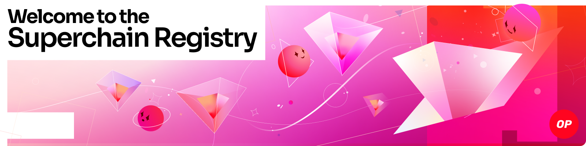

 

> [!WARNING]
> Starting on March 1st, 2025, all standard chains who wish to be added to the Superchain registry **MUST** be deployed using [OP Deployer](https://docs.optimism.io/builders/chain-operators/tools/op-deployer).

The Superchain Registry is an index of chains which serves as the source of truth for who’s in the Superchain Ecosystem and what modifications they’ve made to their chains.

## Quickstart

- ### [👀 See who's in the Superchain Ecosystem](CHAINS.md)
- ### [⚙️ View detailed config information for each chain](superchain/configs)
- ### [📝 Add a new chain to the Superchain Registry](docs/ops.md#adding-a-chain)

## More about the Superchain Registry

The Superchain Registry hosts Superchain-configuration data in a minimal human-readable form and includes mainnet and testnet Superchain targets, along with their respective member chains.

Other configurations, such as contract-permissions and `SystemConfig` parameters, are hosted and governed onchain.

A list of chains in the registry can be seen in the top level [`chainList.toml`](./chainList.toml) and [`chainList.json`](./chainList.json) files.
These files are autogenerated from scripts in the registry and will remain stable to build against.

A glossary, with key terms and more information about Superchain levels and requirements, is available [here](docs/glossary.md).

### Downstream packages

The Superchain configs are stored in a minimal form and embedded in downstream OP-Stack software ([`op-node`](https://github.com/ethereum-optimism/optimism) and [`op-geth`](https://github.com/ethereum-optimism/op-geth)). This means that after a chain has been added to the registry and the dependency on the registry updates in the downstream software, it is possible to start an `op-node` instance [using the `--network` flag](https://docs.optimism.io/builders/node-operators/configuration/consensus-config#network) (and also an `op-geth` instance [using the `--op-network` tag](https://docs.optimism.io/builders/node-operators/configuration/execution-config#op-network-betaop-network)) which will successfully sync with other nodes on that network.

### Hardfork activations
If you would like your chain to automatically receive superchain-wide coordinated hardfork activations, you can enable this by:
1. Adding your chain [as above](/docs/ops.md#adding-a-chain)
2. Ensuring the `superchain_time` in your chain's config is set to an appropriate value.
Set it to `0` if you want to receive all superchain forks that occur after your chain's genesis, and you have activated all superchain forks up to your genesis time at genesis.
3. Having that value reflected in the `main` branch well in advance of the testnet (resp. mainnet) release of `op-geth` and `op-node`.
4. Having your chain's nodes started with the network flags.

This is explained in more detail in this [specification on hardfork activation inheritance behavior](./docs/hardfork-activation-inheritance.md).

## License

MIT License, see [`LICENSE` file](./LICENSE).
